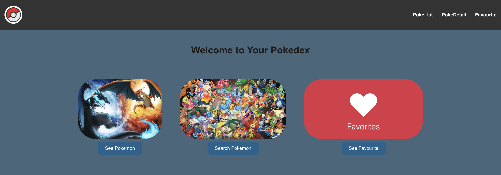
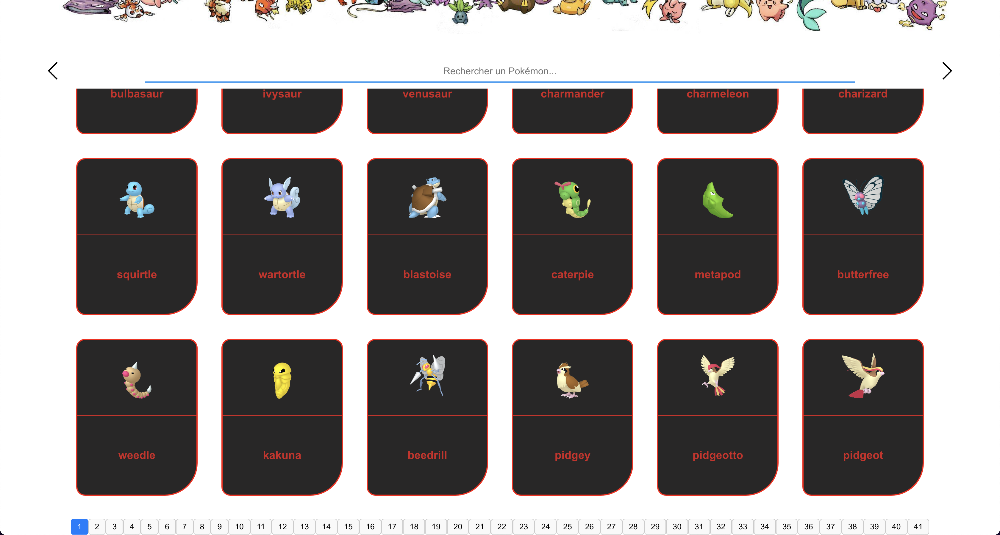
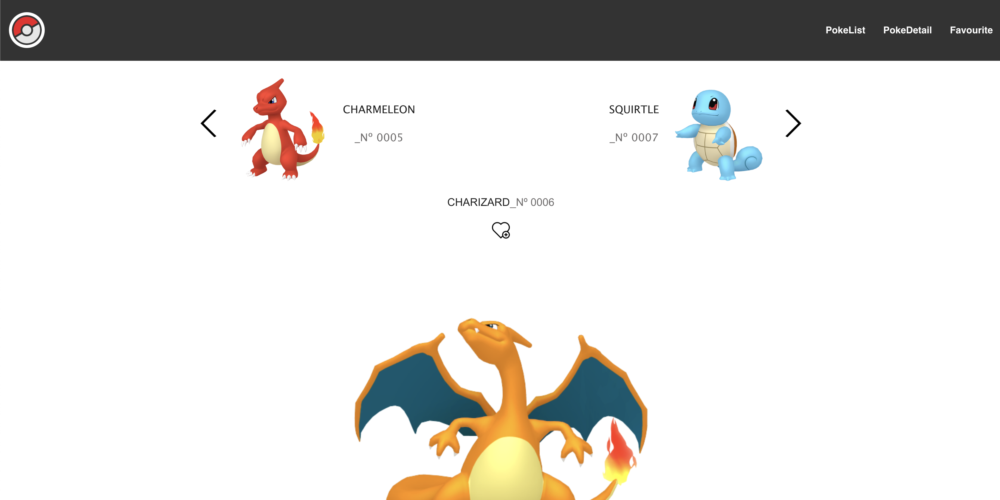
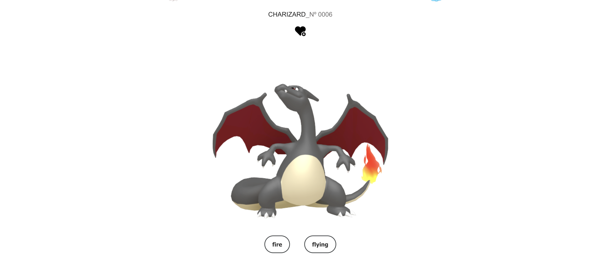
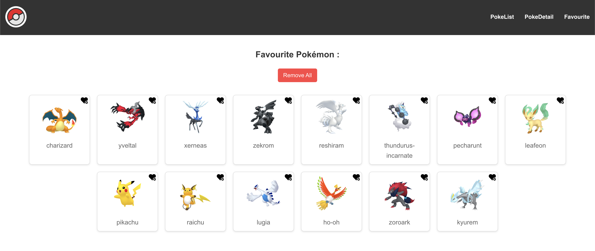

# TS-pokedex
### <span style="color: #3498db;">Technologies : </span>
- The website is coded using:
  - React (TSX)
  - TypeScript
  - Scss
## <span style="color: #5d7bc7">_Getting Started</span>
```bash
cd TS-pokedex
```
```bash
npm install
```
```bash
npm start
```
# <span style="color: #7669d1">_Features</span> :
## Home Page 
-  Welcome page with a user-friendly design to engage users from the start.



## List Page
- Display a comprehensive list of Pokémon with options to view more details.


### Search-Bar
- Search for your favorite Pokémon quickly and easily using the search functionality.



## Detail Page
- Detailed information about each Pokémon including stats, abilities, and more.



### Favourite and Shiny
- Mark Pokémon as your favorites or toggle their shiny versions for a unique display.



### PokeCard
- Visual representation of each Pokémon's stats and other key information like their entire map.


### Evolution-Chain
- View the evolution chain of each Pokémon to see their development stages.


## Favourite Page
- Access a personalized list of your favorite Pokémon for quick reference.


